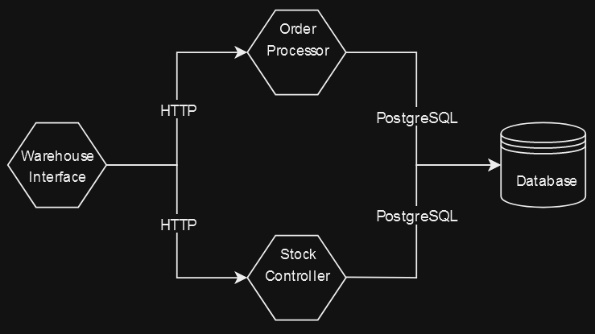

# Tracey Reloaded

Tracey Reloaded is a dummy Kubernetes-based application designed to generate logs, metrics and traces for a 'simulated' warehouse operations. It is intended to be used with OpenTelemetry for the collection of telemetry data and shipping on to Coralogix. The application consists of multiple services: 

## Architecture

### Services

- **Warehouse Interface**: This service acts as the front-end interface for warehouse operations, it simulates order and stock requests on a loop and randomly generates errors. 

- **Order Processor**: Responsible for processing orders, this service handles recieves HTTP requests from Warehouse Interface and communicates with the PostgreSQL database to add and remove orders. 

- **Stock Processor**: Responsible for processing stock, this service handles recieves HTTP requests from Warehouse Interface and communicates with the PostgreSQL database to add and remove stock. 

- **PostgreSQL Database**: A centralized database service that stores has 2 tables, one for orders and one for stock. 



## Prerequisites

- Kubernetes cluster up and running.
- `kubectl` command-line tool installed and configured to communicate with your cluster.

## Clone Git Repository

   Run the following command:
   ```
   git clone https://github.com/georgep1ckers/tracey-reloaded.git
   ```


## Deployment

1. **Start the PostgreSQL Database and Deploy the Services**

   Execute the following script:
   ```
   ./run-tracey.sh
   ```

## Deletion

If you wish to remove the services and the database from your Kubernetes cluster:

1. **Stop & Delete the Services and the PostgreSQL Database**

   Execute the following script:
   ```
   ./stop-tracey.sh
   ```

## Contributing

For contributions, please ensure you are an authorized contributor to this repository and then create a pull request or raise an issue.